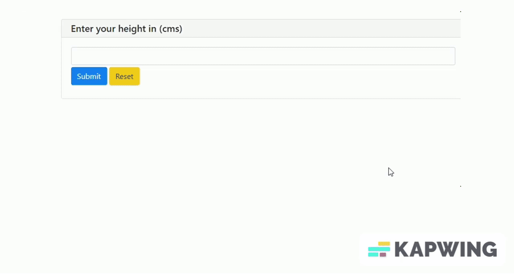

# BMI Calculator using PyWebIO 

This short project demonstrate how to create a simple web app based BMI calculator using a python library, PyWebIO.  

## Acknowledgements

 - [PyWebIO](https://www.pyweb.io/)
 - [PyWebIO_Documentation](https://pywebio.readthedocs.io/en/latest/)
 - [BMI_Wikipedia](https://en.wikipedia.org/wiki/Body_mass_index)

 

## Overview

This project demonstrates how to create a simple BMI calculator based on the user defined values for height and weight and eventually returning whether the person is Underweight,Normal,Overweight or Obese.
## Demo

